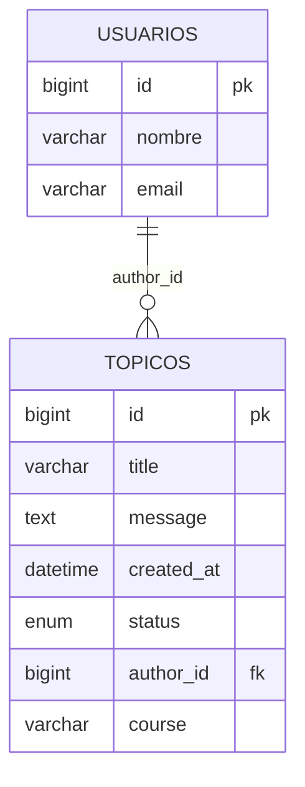
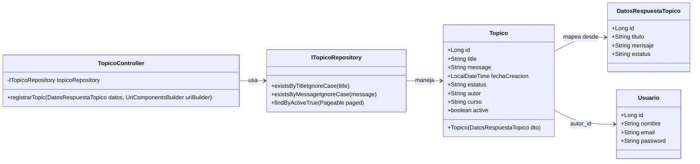

# 🖥️ Foro Hub Challenger


<p align="center">
  
</p>


## 📄 Descripción del proyecto

Foro Hub es un desafío backend para construir una API REST que permita gestionar un foro donde los usuarios puedan crear, consultar, actualizar y eliminar tópicos. El objetivo es replicar las funcionalidades principales del backend de un foro usando Spring Boot, centrándonos en el manejo de tópicos, usuarios y sus interacciones.

La API ofrecerá los siguientes endpoints:

- [x] Crear un nuevo tópico
- [ ] Mostrar todos los tópicos
- [ ] Mostrar un tópico específico
- [ ] Actualizar un tópico
- [ ] Eliminar un tópico

Este proyecto ayuda a profundizar en el diseño de APIs REST, persistencia de datos, validaciones y seguridad.


## 🛠️ Tecnologías y herramientas utilizadas

| Capa / Propósito  | Tecnologías y Herramientas |
|-------------------|----------------------------|
| **Lenguaje**      | Java JDK 17+               |
| **Framework**     | Spring Boot 3+, Spring Web |
| **Persistencia**  | MySQL 8+, Hibernate, Spring Data JPA, Flyway Migration |
| **Construcción**  | Maven 4+, Lombok           |
| **Validación**    | Jakarta Bean Validation (Validation API) |
| **Seguridad**     | Spring Security            |
| **Desarrollo**    | Spring Boot DevTools, IntelliJ IDEA / Eclipse |
| **Testing/API**   | Insomnia                   |


## ⚙️ Instrucciones para configurar el entorno

1. Instalar Java JDK versión 17 o superior.
2. Tener Maven versión 4 o superior instalado.
3. Instalar MySQL versión 8 o superior y configurar la base de datos.
4. Generar el proyecto inicial desde [Spring Initializr](https://start.spring.io/) con las dependencias mencionadas.
5. (Opcional) Usar un IDE como IntelliJ IDEA para facilitar el desarrollo.


## 🗂️ Estructura del proyecto

- **Modelos:** Clases que representan las entidades de la base de datos.
- **Repositorios:** Interfaces para realizar operaciones CRUD en las entidades.
- **Servicios:** Implementación de la lógica de negocio.
- **Controladores:** Endpoints REST para la interacción con clientes.

```
src/
├─ main/
│  ├─ java/
│  │  └─ com/alura/
│  │     ├─ ForoHubChallengerApplication.java        # Clase principal de Spring Boot
│  │     ├─ config/                                  # Configuraciones generales (seguridad, beans)
│  │     ├─ controller/                              # Endpoints REST (controladores)
│  │     │   └─ TopicoController.java
│  │     ├─ domain/                                  # Lógica de negocio y entidades
│  │     │   ├─ topic/                               # Entidades, DTOs y servicios de tópicos
│  │     │   │   ├─ dto/
│  │     │   │   ├─ interfaz/                        # Repositorios (persistencia)
│  │     │   │   └─ service/                         # Lógica de negocio de tópicos
│  │     │   └─ usuario/                             # Entidades y DTOs de usuarios
│  │     │       └─ dto/
│  │     └─ infra/                                   # Infraestructura (security, configuraciones extras)
│  └─ resources/                                     # Recursos de la aplicación
│     ├─ application.properties                      # Configuración principal
│     ├─ db/migration/                               # Migraciones Flyway
│     ├─ static/                                     # Recursos estáticos
│     └─ templates/                                  # Plantillas si se usan vistas

```


## 🗄️ Diagrama de Base de datos



## 📊 Diagrama de clases




## 🚀 Funcionalidades futuras

- Implementar autenticación y autorización de usuarios.
- Validaciones y manejo de errores.
- Paginación y filtrado de tópicos.


## 📬 Contacto

Para dudas o colaboraciones, no dudes en contactarme.

---

*Este proyecto forma parte del desafío Backend de Alura Latam.*
