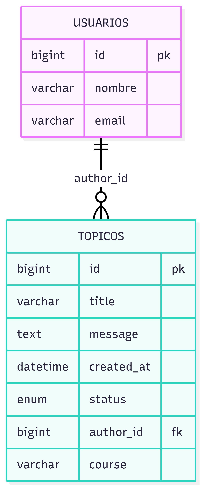
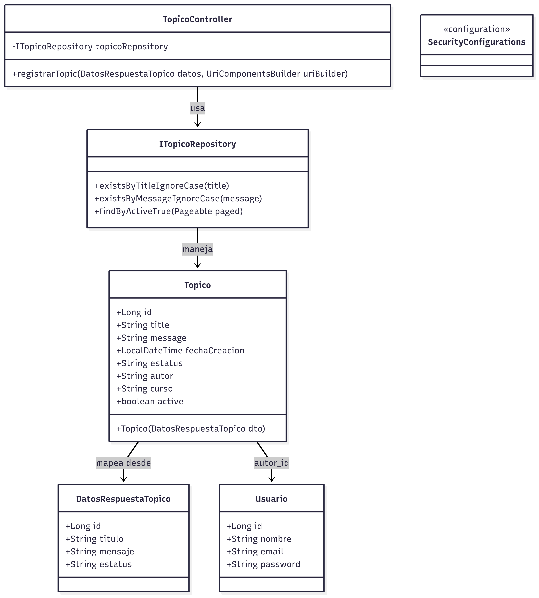

# Foro Hub Challenger

## Descripción del proyecto

Foro Hub es un desafío backend para construir una API REST que permita gestionar un foro donde los usuarios puedan crear, consultar, actualizar y eliminar tópicos. El objetivo es replicar las funcionalidades principales del backend de un foro usando Spring Boot, centrándonos en el manejo de tópicos, usuarios y sus interacciones.

La API ofrecerá los siguientes endpoints:

- Crear un nuevo tópico
- Mostrar todos los tópicos
- Mostrar un tópico específico
- Actualizar un tópico
- Eliminar un tópico

Este proyecto ayuda a profundizar en el diseño de APIs REST, persistencia de datos, validaciones y seguridad.

---

## Tecnologías y herramientas utilizadas

- **Java JDK 17+** — Lenguaje y entorno de ejecución
- **Maven 4+** — Automatización de compilación y gestión de dependencias
- **Spring Boot 3+** — Framework para simplificar el desarrollo backend
- **MySQL 8+** — Sistema gestor de bases de datos relacional
- **Lombok** — Para reducir código repetitivo
- **Spring Web** — Para construir servicios web RESTful
- **Spring Data JPA** — Para interactuar con la base de datos usando JPA/Hibernate
- **Flyway Migration** — Control de versiones y migraciones de base de datos
- **MySQL Driver** — Driver JDBC para conectar Spring Boot con MySQL
- **Validation** — Validación de datos en las peticiones
- **Spring Security** — Para implementar autenticación y autorización
- **Spring Boot DevTools** — Herramienta para desarrollo rápido con recarga automática

---

## Instrucciones para configurar el entorno

1. Instalar Java JDK versión 17 o superior.
2. Tener Maven versión 4 o superior instalado.
3. Instalar MySQL versión 8 o superior y configurar la base de datos.
4. Generar el proyecto inicial desde [Spring Initializr](https://start.spring.io/) con las dependencias mencionadas.
5. (Opcional) Usar un IDE como IntelliJ IDEA para facilitar el desarrollo.

---

## Estructura del proyecto

- **Modelos:** Clases que representan las entidades de la base de datos.
- **Repositorios:** Interfaces para realizar operaciones CRUD en las entidades.
- **Servicios:** Implementación de la lógica de negocio.
- **Controladores:** Endpoints REST para la interacción con clientes.

---

## Diagrama de Base de datos

## Diagrama de Base de datos

## Funcionalidades futuras

- Implementar autenticación y autorización de usuarios.
- Validaciones y manejo de errores.
- Paginación y filtrado de tópicos.

---

## Contacto

Para dudas o colaboraciones, no dudes en contactarme.

---

*Este proyecto forma parte del desafío Backend de Alura Latam.*
